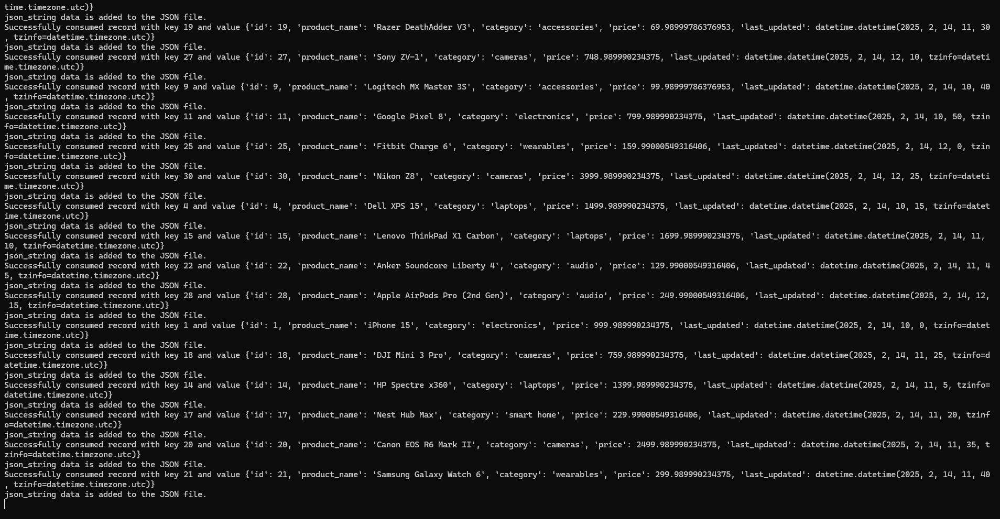
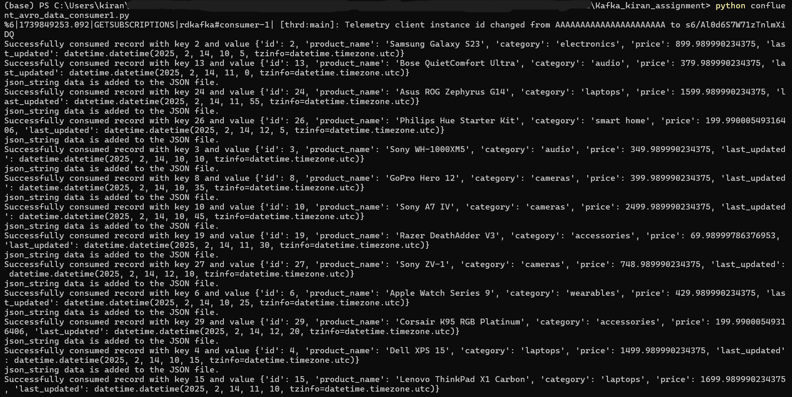

# Real-Time Data Processing with Confluent Kafka, MySQL, and Avro

## Overview
This project demonstrates a real-time data pipeline using Confluent Kafka, MySQL, and Avro serialization. It simulates an e-commerce scenario where product updates in a MySQL database are streamed to Kafka, processed by a consumer group, and stored in JSON format.

## Technologies Used
- Python 3.7+
- Confluent Kafka Python client
- MySQL Database
- Apache Avro
- Apache Kafka
- JSON for data storage

## Project Workflow
### 1. MySQL Table Setup
- Create a product table in MySQL.
- Insert data into the table.

### 2. Kafka Producer
- Fetch incremental data from MySQL based on `last_updated` timestamp.
- Serialize the data using Avro.
- Publish messages to a Kafka topic (`product_updates`) with 10 partitions.
- Use product ID as the partition key.

### 3. Kafka Consumer Group
- Set up 4 consumers to process the Kafka topic.
- Deserialize Avro messages.
- Transform data (e.g., uppercase category, apply discounts).
- Append transformed data as JSON to separate files.

### 4. Data Storage
- Each consumer writes JSON-formatted records into output files.

## Installation & Setup
### Prerequisites
- Install Kafka and MySQL.
- Set up Confluent Kafka Python client:
    ```bash
    pip install confluent-kafka avro-python3 mysql-connector-python
    ```

### Running the Application
1. **Start MySQL Database**
    - Make sure MySQL is running.
    - Create the `product` table using the SQL commands provided in `create_table.sql`.

2. **Start Kafka Cluster**
    - Ensure Kafka is running and create the `product_updates` topic:
        ```bash
        kafka-topics.sh --create --topic product_updates --bootstrap-server localhost:9092 --partitions 10 --replication-factor 1
        ```

3. **Run the Producer**
    ```bash
    python producer.py
    ```

4. **Run the Consumers**
    ```bash
    python consumer.py
    ```

5. **Check the Output Files**
    - Each consumer will write JSON-formatted records into the output files.

## Deliverables
- Python scripts for producer and consumer.
- SQL queries for incremental data fetch.
- Avro schema for serialization.
- Data transformation logic.
- Sample JSON output files.

## Screenshots
Here are some screenshots of the running application:

- **Producer Output:**
  

- **Consumer Output:**
  

